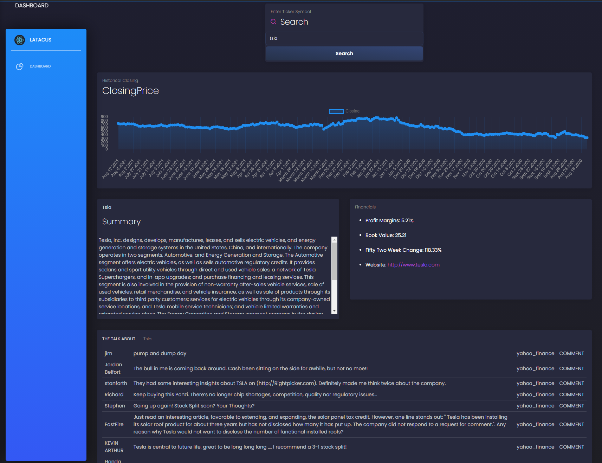

In order to use, the server requires a dot env config where if you create a .env file, 
you can put in your rapid api key.

This makes it such that your server is in charge of handling requests to the api.

Clientside, you could change the fetches to instead point directly to the rapid api,
but this could get bloated in code with destructuring and filtering it.

I try to filter the data in the backend for better display.

